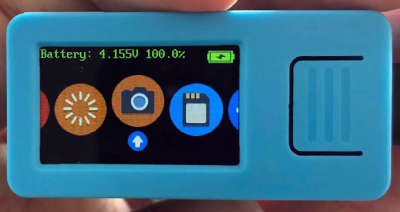

# M5StickVComputer

A pure Python written Operating System for M5StickV (https://docs.m5stack.com/#/en/core/m5stickv)

DONE:

* Camera preview with face recognization
* Partially functional file explorer
* Buttons exvent handling
* Icon switching animations

TODO:

* Full functional file explorer
* Video recording
* Microphone recording
* Wav audio player
* Settings (brightness, power saving, etc)

